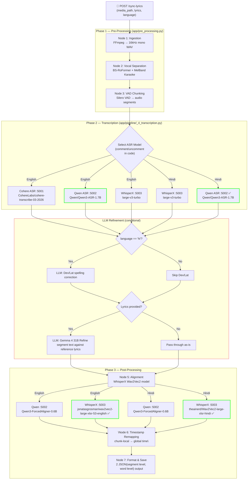

<h1 style="color:#e94560;">🧑‍💻 Developer README: Lyrics Synchronization Service</h1>

<h2 style="color:#f5a623;">1. Purpose</h2>

This service takes an audio/video file and its lyrics as input, and produces a **word-level time-synchronized JSON** — mapping every word to its exact millisecond position in the audio. It supports **English** and **Hindi** (including Hinglish / mixed-script) songs.

---

<h2 style="color:#f5a623;">2. Architecture</h2>

> <h3 style="color:#4fc3f7;">2.1 Full Pipeline — Mermaid Diagram</h3>



> <h3 style="color:#4fc3f7;">2.2 Why LLM Is Used ?</h3>

| LLM Mixin | Purpose | When Invoked |
|-----------|---------|-------------|
| `RefineDev` | Normalises Hinglish→Devanagari spelling/matras via LLM | **Always** on Hindi pipeline — when transcription is in Latin script |
| `RefineLat` | Normalises Devanagari→Hinglish spelling via LLM | **Always** on Hindi pipeline — when transcription is in Devanagari script |
| `RefineLyricsSegment` | Can't pass the whole lyrics to alignment beacuse now audio is splitted into chunks. Aligns ASR segment text against user-provided lyrics. Fills missing words, replaces misheard words, expands contractions. | Only when `lyrics` field is non-empty (English or Hindi) |

---

<h2 style="color:#f5a623;">3. Cache System</h2>

Every pipeline node caches its output in `app/cache/`. This means **re-running the same song skips already-completed stages** and only Alignment node which is never cached.  
> **NOTE:** Implemented to give user a optimized retry mechanism to only execute nodes which you want by modifying or deleting cached files.  

<h3 style="color:#4fc3f7;">3.1 Cache Directory Structure</h3>

```
app/cache/
├── ingestions/           ← Node 1: Converted 16kHz mono WAV files
│   └── <song_name>.wav
│
├── seperations/          ← Node 2: Isolated vocal tracks
│   └── <song_name>_vocals.wav
│
├── vad_chunks/           ← Node 3: VAD segment boundaries + audio arrays
│   ├── <song_name>_vad.json        (timestamps — human-editable)
│   └── <song_name>_vad_audio.npz   (numpy audio arrays)
│
├── transcriptions/       ← Node 4: Raw ASR transcription text
│   ├── <song_name>_<lang>_raw_transcription.json      (text — human-editable)
│   └── <song_name>_<lang>_raw_transcription_audio.npz  (numpy audio arrays)
│
└── llm/                  ← LLM refinement results
    ├── <song_name>_<lang>_llm_segments.json    (refined lyrics segments)
    ├── <song_name>_llm_dev.json                (Devanagari corrections)
    └── <song_name>_llm_lat.json                (Latin/Hinglish corrections)
```

<h3 style="color:#4fc3f7;">3.2 Retrying Specific Pipeline Stages</h3>

Since each node checks for its cache before executing, you can **selectively re-run any stage** by deleting only that stage's cache files. Downstream nodes will also re-execute if their inputs change.

| To retry... | Delete these files/folders |
|-------------|-----------------------------|
| **Everything** (full re-run) | Delete the entire `app/cache/` directory |
| **Vocal Separation** onwards | Delete `app/cache/seperations/`, `vad_chunks/`, `transcriptions/`, `llm/` |
| **VAD Chunking** onwards | Delete `app/cache/vad_chunks/`, `transcriptions/`, `llm/` |
| **Transcription** onwards | Delete `app/cache/transcriptions/`, `llm/` |
| **LLM Refinement** only | Delete `app/cache/llm/` |
| **Only a specific song** | Delete all files containing `<song_name>` across the cache subdirectories |

> **Tip:** The `.json` cache files (VAD, transcription, LLM) are human-readable and editable. You can manually tweak segment boundaries in `vad_chunks/<song>_vad.json` or fix transcription text in `transcriptions/<song>_<lang>_raw_transcription.json` before re-running downstream stages.

> **Note:** Nodes 5 (Alignment), 6 (Timestamp Remapping), and 7 (Format & Save) do NOT have their own cache — they always re-execute. This means deleting the LLM cache is sufficient to re-run alignment and output generation with fresh data.

---

<h2 style="color:#f5a623;">4. Pipeline Nodes — Detailed Functioning</h2>

<h3 style="color:#4fc3f7;">Node 1 — Ingestion (<code>app/pipeline/_1_ingestion.py</code>)</h3>

**Purpose:** Normalises any input media file into a consistent audio format for downstream processing.

**What it does:**
1. Validates that FFmpeg is installed and on PATH.
2. Converts the input file (MP3, MP4, M4A, FLAC, OGG, AAC, WAV) into a **16kHz, mono, 16-bit PCM WAV** using FFmpeg.
3. Strips all video streams (`-vn`) while preserving metadata.
4. Validates the output duration is between 5s and 600s (10 minutes).

**Cache:** `app/cache/ingestions/<song_name>.wav`

---

<h3 style="color:#4fc3f7;">Node 2 — Vocal Separation (<code>app/pipeline/_2_seperation.py</code>)</h3>

**Purpose:** Isolates the lead vocal track from the full mix, removing instruments, background vocals, harmonies, and ad-libs.

**What it does (two-pass approach):**

1. **Pass 1 — BS-RoFormer** (`model_bs_roformer_ep_317_sdr_12.9755.ckpt`, ~700 MB download)
   - Separates vocals from the full mix at the model's native **44.1kHz** sample rate.
   - SDR 12.97 — current gold standard for vocal isolation.
   - Audio is NOT resampled before the model sees it (resampling before separation destroys high-frequency content like vibrato/overtones).

2. **Pass 2 — Mel-Band RoFormer Karaoke** (`mel_band_roformer_karaoke_aufr33_viperx_sdr_10.1956.ckpt`, ~1 GB download)
   - Strips background vocals, harmonies, and ad-libs from the isolated vocal track.
   - Improves downstream ASR accuracy by removing overlapping harmony words.

3. **Final step** — Resamples the clean lead vocals from 44.1kHz → **16kHz mono** via FFmpeg (for ASR/VAD compatibility).

> **History:** Initially used **Demucs** (SDR 10.8) for vocal separation, but switched to **audio-separator** with BS-RoFormer because Demucs produced husky/robotic artifacts that degraded downstream ASR accuracy. BS-RoFormer preserves vocal timbre much better.

**Cache:** `app/cache/seperations/<song_name>_vocals.wav`

---

<h3 style="color:#4fc3f7;">Node 3 — VAD Chunking (<code>app/pipeline/_3_vad_chunking.py</code>)</h3>

**Purpose:** Splits the vocal track into time-bounded chunks containing speech/singing, discarding silence and instrumental breaks.

**What it does:**
1. Loads the vocal audio and runs **Silero VAD** (Voice Activity Detection).
2. Merges segments with small gaps (≤ 800ms) to avoid splitting mid-phrase.
3. Applies head-guard (pulls first segment to 0s if vocals start within 3s) and tail-guard (extends last segment to file end if within 8s).
4. Splits overly long segments at energy minima (≤ 20s each) to avoid cutting mid-word.
5. Filters out micro-segments shorter than 200ms.
6. Outputs a list of `{start, end, audio}` chunks.

**⚠️ Tunable Parameters** — Different songs may need different settings. If some vocals are being missed or segments are cut incorrectly, adjust these constants at the top of the file:

```python
# app/pipeline/_3_vad_chunking.py — lines 38-54

VAD_THRESHOLD          = 0.20   # Lower = more sensitive (catches soft/breathy vocals)
VAD_MIN_SPEECH_MS      = 100    # Minimum speech burst duration to keep
VAD_MIN_SILENCE_MS     = 400    # Silence duration required to close a segment
VAD_SPEECH_PAD_MS      = 200    # Padding on both sides of each segment

MAX_CHUNK_DURATION     = 20.0   # Force-split longer segments (seconds)
MIN_CHUNK_DURATION     = 0.2    # Drop segments shorter than this
MERGE_GAP_THRESHOLD    = 0.800  # Bridge gaps ≤ this value (seconds)

TAIL_GUARD_SEC         = 5.0    # Extend last segment if within this of file end
HEAD_GUARD_SEC         = 3.0    # Pull first segment to 0 if it starts within this
```

> **Tip:** For songs with very soft/breathy vocals, lower `VAD_THRESHOLD` (e.g. 0.10). For rap with rapid-fire delivery, lower `VAD_MIN_SILENCE_MS` (e.g. 200).

**Cache:** `app/cache/vad_chunks/<song_name>_vad.json` + `<song_name>_vad_audio.npz`

---

<h3 style="color:#4fc3f7;">Node 4 — Transcription (<code>app/pipeline/_4_transcription.py</code>)</h3>

**Purpose:** Converts each audio chunk into text using an ASR (Automatic Speech Recognition) model.

**Currently 3 models are configured:**

| # | Model | Service | Size | Best For |
|---|-------|---------|------|----------|
| 1 | `CohereLabs/cohere-transcribe-03-2026` | `:5001` | ~5 GB | Top HuggingFace leaderboard |
| 2 | `Qwen/Qwen3-ASR-1.7B` | `:5002` | ~5 GB | **✅ Best for this use-case (English)** |
| 3 | WhisperX `large-v3-turbo` | `:5003` | ~1.5 GB | **✅ Best for Hindi transcription** |

**How to switch models:** Comment/uncomment the URL lines in [`app/pipeline/_4_transcription.py` (lines 49–56)](app/pipeline/_4_transcription.py):

```python
# app/pipeline/_4_transcription.py — lines 49-56

if language == "en":
    # url = COHERE_BASE_URL + "transcribe"
    url = QWEN_BASE_URL + "transcribe"           # ← Currently active for English
    # url = WHISPERX_BASE_URL + "transcribe"
elif language == "hi":
    # url = QWEN_BASE_URL + "transcribe-hi"
    url = WHISPERX_BASE_URL + "transcribe-hi"     # ← Currently active for Hindi
```

> **Important:** After switching, delete `app/cache/transcriptions/` AND `app/cache/llm/` to force a fresh transcription + LLM refinement.

#### LLM Refinement (post-transcription)

After raw transcription, if the user provides lyrics, the system uses an **LLM (Gemma 4 31B)** to refine the ASR output:

- **English (`process_en_language`):** Sends the raw transcribed segments + reference lyrics to the LLM. The LLM corrects misheard words, fills dropped words, and expands contractions (e.g. `I'm` → `I am`) for better forced-alignment.

- **Hindi (`process_hi_language`):** More complex due to mixed-script handling:
  1. Builds a bidirectional word map (Devanagari ↔ Latin/Hinglish) using `indic_transliteration`.
  2. Converts all transcription text to Latin script (the LLM works in Latin).
  3. Calls `refine_lyrics_segment()` to align ASR text against reference lyrics.
  4. Converts the refined text back to Devanagari for the alignment model.
  5. Additionally runs `refine_dev()` or `refine_lat()` for spelling/matra correction.

**Cache:** `app/cache/transcriptions/` (raw ASR) + `app/cache/llm/` (LLM refined)

---

<h3 style="color:#4fc3f7;">Node 5 — Alignment (<code>app/pipeline/_5_alignment.py</code>)</h3>

**Purpose:** Produces word-level timestamps by aligning the transcribed text against the audio using forced alignment.

**Currently configured models:**

| # | Model | Language | Notes |
|---|-------|----------|-------|
| 1 | `Qwen/Qwen3-ForcedAligner-0.6B` | English only | Available on Qwen service (:5002) |
| 2 | WhisperX Wav2Vec2 (`jonatasgrosman/wav2vec2-large-xlsr-53-english`) | English | **✅ Currently active** |
| 3 | WhisperX Wav2Vec2 (`theainerd/Wav2Vec2-large-xlsr-hindi`) | Hindi | **✅ Currently active — best working model for Hindi** |

The alignment is currently routed through the **WhisperX service (:5003)** for both languages, as the Wav2Vec2-based forced alignment works best for this use-case.

**Cache:** None (always re-executes).

---

<h3 style="color:#4fc3f7;">Node 6 — Timestamp Remapping (<code>app/pipeline/_6_timestamp_remapping.py</code>)</h3>

**Purpose:** Converts chunk-local timestamps to global (full-song) timestamps.

**What it does:**
1. Each alignment produces timestamps relative to the chunk's start (0-based). This node adds the chunk's original `start` offset to every word timestamp.
2. Validates word time-spans — any word with a duration < 100ms is merged with its neighbour to prevent overly fragmented output.

**Cache:** None (always re-executes).

---

<h3 style="color:#4fc3f7;">Node 7 — Format & Save (<code>app/pipeline/_7_format_and_save.py</code>)</h3>

**Purpose:** Converts the internal data structure into the final JSON output format.

**What it does:**
1. For Hindi: applies final script conversion (Devanagari ↔ Latin) based on the `devanagari_output` flag.
2. Saves the raw aligned data as `<song_name>_raw.json` (intermediate — useful for debugging).
3. Converts to the final consumer format with `text`, `startMs`, `endMs`, `timestampMs` fields.
4. Inserts a leading spacer segment (from 0ms to first word) and a trailing spacer segment (from last word to end of audio).
5. Saves the final output as `<song_name>.json` at the user-specified `output_path`.

**Cache:** None (always re-executes).

---

<h2 style="color:#f5a623;">5. Alternatives Explored (What Didn't Work)</h2>

During development, several alternative models and tools were evaluated but did not perform well enough for this use-case:

<h3 style="color:#4fc3f7;">Transcription (ASR)</h3>

| Model/Tool | Result |
|-----------|--------|
| `CohereLabs/cohere-transcribe-03-2026` | Top on HuggingFace leaderboard, but did not perform better than Qwen for song lyrics specifically |
| `ai4bharat` and other open-source HuggingFace Hindi ASR models | None of them worked well for Hindi song transcription (trained on speech, not singing) |

<h3 style="color:#4fc3f7;">Forced Alignment</h3>

| Tool | Result |
|------|--------|
| **MFA** (Montreal Forced Aligner) | Did not work as expected for song lyrics |
| **CTC Forced Aligner** (`ctc-forced-aligner`) | Inaccurate alignment — processed 4 minutes in 3 seconds with poor quality |
| **BFA** (Boundary Forced Aligner) | Not working as expected |
| **SOFA** (Singing-Oriented Forced Aligner) | Not working as expected |
| **HubertFA** (Hubert Forced Aligner) | ONNX-based, lightweight but alignment quality insufficient |

The **WhisperX Wav2Vec2** pipeline with language-specific models proved to be the most reliable for both English and Hindi alignment.

---

<h2 style="color:#f5a623;">6. Key File Reference</h2>

```
project-root/
│
├── app/
│   ├── main.py                          ← FastAPI app entry point (port 5000)
│   ├── routes.py                        ← POST /sync-lyrics endpoint
│   ├── pre_processing.py               ← Orchestrates Nodes 1-3
│   │
│   ├── pipeline/
│   │   ├── _1_ingestion.py              ← Node 1: FFmpeg conversion
│   │   ├── _2_seperation.py             ← Node 2: BS-RoFormer vocal isolation
│   │   ├── _3_vad_chunking.py           ← Node 3: Silero VAD segmentation
│   │   ├── _4_transcription.py          ← Node 4: ASR dispatch + LLM refinement
│   │   ├── _5_alignment.py              ← Node 5: Forced alignment dispatch
│   │   ├── _6_timestamp_remapping.py    ← Node 6: Local → global timestamps
│   │   └── _7_format_and_save.py        ← Node 7: Final JSON output
│   │
│   ├── llm/
│   │   ├── base.py                      ← Gemma 4 31B client (Google GenAI SDK)
│   │   ├── llm_service.py               ← Singleton facade for all LLM tasks
│   │   ├── refine_lyrics_segment.py     ← Corrects ASR text against lyrics
│   │   ├── refine_dev.py                ← Hinglish → Devanagari normaliser
│   │   └── refine_lat.py                ← Devanagari → Hinglish normaliser
│   │
│   ├── helpers/
│   │   ├── config.py                    ← Global constants (DEVICE, SAMPLE_RATE, API keys)
│   │   ├── utils.py                     ← Text cleaning, word mapping, script conversion
│   │   ├── en/process_en.py             ← English post-transcription processing
│   │   └── hi/
│   │       ├── process_hi.py            ← Hindi post-transcription processing
│   │       ├── process_helper.py        ← Script conversion orchestration
│   │       └── transliteration.py       ← Devanagari ↔ Hinglish transliteration
│   │
│   └── cache/                           ← All intermediate cached data
│
├── transcribe/
│   ├── cohere-asr/main.py               ← Cohere ASR service (port 5001)
│   ├── qwen-asr/main.py                 ← Qwen ASR + Aligner service (port 5002)
│   └── whisperx/main.py                 ← WhisperX ASR + Aligner service (port 5003)
│
├── HOW_TO_SETUP.md                      ← Environment setup guide
└── README.md                            ← Consumer-facing documentation
```

---

<h2 style="color:#f5a623;">7. Environment Variables</h2>

Create an `.env` file in the `app/` directory (see `app/.env.example`):

```env
GEMINI_API_KEY=your_gemini_api_key_here
COHERE_API_KEY=your_cohere_api_key_here
```

- **`GEMINI_API_KEY`** — Required for LLM refinement (Gemma 4 31B via Google GenAI). Without this, the pipeline will fail when lyrics are provided.
- **`COHERE_API_KEY`** — Only needed if you switch the LLM to use Cohere.

---

<h2 style="color:#f5a623;">8. Limitations</h2>

1. **One song at a time** — The pipeline processes a single media file per request. Concurrent requests are not supported due to GPU memory constraints (models are loaded/unloaded per request).
2. **Heavy resource requirements** — Requires an NVIDIA GPU with sufficient VRAM. The vocal separation models alone consume ~2-4 GB VRAM, and ASR models need an additional 2-5 GB.
3. **First-run model downloads** — On first execution, several large models are downloaded automatically:
   - BS-RoFormer: ~700 MB
   - Mel-Band RoFormer Karaoke: ~1 GB
   - ASR model (Qwen/Cohere/WhisperX): ~1.5 to 5 GB each
   - Silero VAD: ~small (auto-cached by PyTorch Hub)
4. **LLM dependency** — When lyrics are provided, the pipeline depends on the Google GenAI API (external network call). If the API is down or rate-limited, LLM refinement will fail (with fallback to raw ASR text).
5. **Hindi alignment model limitations** — Only one feasible Wav2Vec2 model exists for Hindi forced alignment (`theainerd/Wav2Vec2-large-xlsr-hindi`). Alignment quality for Hindi is inherently lower than English.

---
