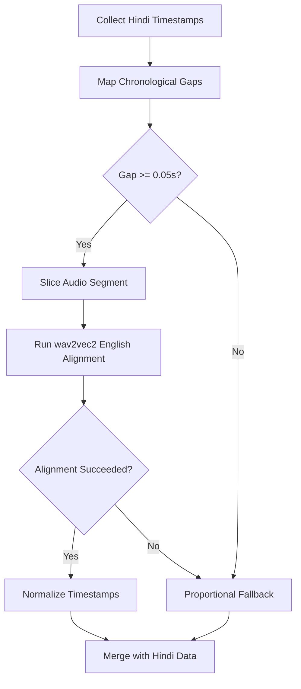

# 🎵 Lyrics Synchronization Engine

A multilingual lyrics-to-audio alignment system supporting **English** and **Hindi (Devanagari / Hinglish)** with intelligent fallback strategies, LLM-assisted normalization, and dynamic gap-filling for mixed-language content.

---

## Table of Contents

- [Example](#example)
- [How to Run](#how-to-run)
- [Architecture](#architecture)
- [Processing Pipelines](#processing-pipelines)
  - [Case 1: English Songs](#case-1-english-songs)
  - [Case 2: Hindi Songs](#case-2-hindi-songs)
- [Unified LLM Pipeline (`RefineHinglish`)](#unified-llm-pipeline-refinehinglish)
  - [Pre-Transliteration](#pre-transliteration)
  - [LLM Refinement Layer](#llm-refinement-layer)
- [Key Functions](#key-functions)
  - [Handling English Words Inside Hindi Songs](#handling-english-words-inside-hindi-songs)
  - [fill_english_gaps()](#fill_english_gaps)
- [Models Used](#models-used)


## Example:

Do a Post Request with this payload.

```json
{
  "media_path": "C:\\Users\\user_name\\Downloads\\music.mp4", # can also give .mp3 or .wav
  "output_path": "C:\\Users\\user_name\\Downloads\\",   
  "language": "en" or "hi",   # Actual Language of the song.
  "lyrics": "abcd",
  "force_alignment": "False",
  "devanagari_output": "True",
  "isolate_vocals": "True"
}
```

RESPONSE:
```json
{"message": "Synchronization complete", "output_path": "path/music_name.json"}
```

JSON OUTPUT:
```JSON
[
  {
        "text": " Been",
        "startMs": 14400,
        "endMs": 14594,
        "timestampMs": 14400,
        "confidence": 0.2
    },
    {
        "text": " a",
        "startMs": 14616,
        "endMs": 14637,
        "timestampMs": 14616,
        "confidence": 0.004
    },
    {
        "text": " while",
        "startMs": 14659,
        "endMs": 14745,
        "timestampMs": 14659,
        "confidence": 0.113
    },
]
```

---

## How to Run

```bash
winget install Python.Python.3.11

git clone git@github.com:rishi058/lyrics-synchronization-service.git
cd lyrics-synchronization-service
py -3.11 -m venv .venv
.venv\Scripts\activate
pip install -r requirements.txt

(.venv) python main.py
http://localhost:5001/health
```


---

## Architecture
```text
[ Audio Input ]
      |
[ Remove Music Demucs(Keep only vocals) ]
      |
[ Silero-VAD(to trim starting + ending no-vocal section) ]
      |
      ├── Language = EN ──────────────────────────────────────────┐
      │                                                           │
      │   [ Lyrics Provided? ]                                    │
      │         ├── YES → [ wav2vec2 (EN) forced alignment ]      │
      │         └── NO  → [ Whisper large-v3 transcription ]      │
      │                              ↓                            │
      │                       [ wav2vec2 (EN) ]                   │
      │                              ↓                            │
      │         [ Word-level Timestamps (Latin output) ]          │
      │                                                           │
      └── Language = HI ──────────────────────────────────────────┐
          │
          [ Lyrics Provided? ]
                ├── YES → [ Script Detection ]
                │               ├── Hinglish   → [ Convert latin to Devanagari-script[use transileration for it] ]
                │               │                [ LLM to refine both script ]
                │               │                [ Handling hindi and english words seperately ]
                │               │                (store map: devanagari → hinglish) for the purpose of giving hinglish output
                │               │                                   ↓
                │               │                               [ MERGE ]
                │               │
                │               └── Devanagari → [ use transileration to generate Hinglish then use LLM to refine both ]
                │                                [ Handling hindi and english words seperately ]
                │                                (store map: devanagari → hinglish) for the purpose of giving hinglish output
                │                                                   ↓
                │                                               [ MERGE ]
                │
                └── NO  → [ Transcribe : [Whisper large-v3] : (outputs Devanagari script) ]
                          [ use transileration to generate Hinglish then use LLM to refine both ]
                          [ Handling hindi and english words seperately ]
                          (store map: devanagari → hinglish) for the purpose of giving hinglish output
                                                ↓
                                            [ MERGE ]
                                                │
          ┌─────────────────────────────────────┴────────────────────────────────────────────────────────┐
          │ [ Wav2Vec2-large-xlsr-hindi alignment (uses Devanagari only) ]                               │
          └─────────────────────────────────────┬────────────────────────────────────────────────────────┘
                                                ↓
                                    [ English words in song? ]
                                                ├── YES → [ fill_english_gaps() ]
                                                │
                                                ↓
                  [ devanagari_output(may not be purely devanagari, which is fine) ]
                                                ├── True  → [ return the final result ]
                                                └── False → [ using the mapp, get the hinglish version then return the result. ]
                                                │
                                                ↓
      [ Word-level Timestamps (Hinglish or Devanagari[+ English words if present]) ]
```

---

## Processing Pipelines

### Case 1: English Songs

#### Sub-case A — No Lyrics Provided
1. **Transcription**: Audio is passed to `Whisper large-v3`, which produces a raw transcript with approximate word/segment timestamps.
2. **Alignment**: The transcript is then refined using `wav2vec2-large-xlsr-53-english` forced alignment to produce accurate word-level timestamps.
3. **Output**: Word timestamps in Latin script.

#### Sub-case B — Lyrics Provided
1. **Skip transcription** entirely.
2. **Forced Alignment**: Provided lyrics are directly aligned to audio using `wav2vec2-large-xlsr-53-english`.
3. **Output**: Word timestamps in Latin script, tightly matched to the user-supplied lyrics text.

---

### Case 2: Hindi Songs

#### Sub-case A — No Lyrics Provided
1. **Transcription**: Whisper `large-v3` transcribes the audio. Its Hindi output is natively in **Devanagari script**.
2. **LLM Validation**: The transcript is passed to `process_helper.process_devanagari_script()`. It transliterates words to ITRANS and runs the LLM to identify English words (which Whisper often incorrectly writes in Devanagari due to accent).
3. **Alignment**: Hindi (Devanagari) words are aligned using `theainerd/Wav2Vec2-large-xlsr-hindi`.
4. **English gap-filling**: English words identified by the LLM are aligned separately via `fill_english_gaps()`.
5. **Output Control**:
   - `devanagari_output = true` → export as-is in Devanagari.
   - `devanagari_output = false` → convert to Hinglish using the `word_mapp` populated during the LLM processing.

#### Sub-case B — Lyrics Provided (Hinglish or Devanagari input)
1. **Script Detection**: Determine whether the provided lyrics are in Hinglish (Latin alphabet) or Devanagari.
2. **Processing Pipeline**:
   - Depending on the detected script, either `process_devanagari_script()` or `process_latin_script()` is invoked.
   - Initial rule-based transliteration runs first (via `indict_transliteration` mapping to ITRANS or Devanagari).
   - The unified `RefineHinglish` pipeline corrects the `lang` tags (identifying English words) and refines the transliteration to fix spelling errors.
   - This process builds a **reverse-map** that maps the final Devanagari word to its refined Latin spelling.
   - Align the Devanagari lyrics with the Hindi wav2vec2 model.
   - Run `fill_english_gaps()` for any English words that were present in the lyrics.
   - Apply `format_word_text()` logic on output which restores the **refined Hinglish spellings** using the reverse mapping if `devanagari_output` is `false`.

---

### Reverse-mapping for output fidelity

When a user provides Hinglish lyrics, they expect Hinglish back in the sync data — not Devanagari, and not rigid ITRANS transliterations. The reverse-map (`word_mapp`) stores:

```
"तेरा" → "tera"
"प्यार" → "pyaar"   # user's original/refined spelling preserved
```

This ensures the final sync output provides a natural and correct Hinglish representation, character for character.

---

## Unified LLM Pipeline (`RefineHinglishSong`)

### Why LLM normalization is necessary

The single `RefineHinglish` agent acts as a **semantic translator** — it understands that `"pyar"` is `"प्यार"`, `"teri"` is `"तेरी"`, and `"hoga"` is `"होगा"` — none of which ITRANS reliably handles. The LLM response also correctly assigns each word a `lang` (`"hi"` or `"en"`), which drives the English gap-fill logic downstream.

Hinglish is Hindi written in Latin characters. It is informal and has no standardized spelling — `"kyun"`, `"kyu"`, `"kyoon"` are all valid representations of `"क्यों"`. Rule-based transliteration systems like ITRANS fail on this input because:

- They require **standardized Latin encodings**, not casual typed forms.
- They cannot infer intent from ambiguous romanizations.
- They produce incorrect Devanagari for colloquial contractions


All contextual normalization is centralized within `helpers/hi/process_helper.py` which passes words to `RefineHinglishSong` (`helpers/hi/llm/refine_lyrics.py`). This performs transliteration refinement and language detection in a single, efficient LLM pass via **Cohere `command-a-03-2025`** (using LangChain structured outputs).

### Pre-Transliteration
Before the LLM is hit, rules-based pre-processing steps run (`helpers/hi/transliteration.py`):
- Converts the string to a list of `{lat, dev, lang}` dictionary tokens.
- Fills in rough ITRANS/Devanagari defaults using `indic_transliteration`.
- Attempts a naive `lang` tag initialization via `wordfreq`.

### LLM Refinement Layer
The populated dictionary tokens are sent in a batch to the `RefineHinglish` LLM prompt:
- **Validates Tags**: Corrects naive mappings (e.g. tagging true English words as `"en"` and catching "Hinglish-looking" Hindi words like `"Aja"` or `"ko"` to assign them `"hi"`).
- **Refines Spelling**: Corrects rough ITRANS phoneme errors (e.g., changes `"Mujhay"` -> `"मुझे"` accurately).
- **Graceful Fallback**: If the LLM API call fails, the pipeline automatically falls back to the original dictionary array using the unrefined `indic_transliteration` results, ensuring processing completes.

---

## Key Functions

## Handling English Words Inside Hindi Songs

Real-world Hindi songs frequently contain English words — lines like *"baby mujhe chhod ke mat ja"* or *"feeling something"*. These words are problematic because:

1. The **Hindi wav2vec2 model is trained on Devanagari phonemes** — it cannot align Latin-script English words.
2. They are simply **absent from `sync_data`** after Hindi alignment, leaving gaps in the timeline.

### Solution: `fill_english_gaps()`

This function runs post-Hindi-alignment whenever English words are detected. It bridges the silence left by unaligned English words using a targeted English alignment model.

**Step-by-step logic:**

```
1. Collect all Hindi word timestamps → sorted timeline
2. Identify gaps between consecutive Hindi words
3. Map each English word (from the LLM's lang="en" tags) to a gap
4. For each gap:
   a. Slice the audio segment for that gap
   b. Run wav2vec2 (English) forced alignment on the mini-segment
   c. If alignment succeeds → insert timestamps into sync_data
   d. If alignment fails → _proportional_fallback():
      split gap duration equally among English words in that gap
5. Merge Hindi + English timestamps → final sorted sync_data
```

This means English words in a Hindi song are **never silently dropped** — they either get precise timestamps from the English aligner, or reasonable proportional estimates.

---

### `fill_english_gaps()`

**Purpose**: Align English words that appear inside Hindi songs, using the gaps left in the Hindi alignment timeline.

**Triggered when**: `language = "hi"` AND English words (`lang: "en"`) were found by the RefineHinglish analysis.

**Gap assignment strategy**:
- Gaps are sorted by duration (longest first) if there are more gaps than English word clusters.
- English words are distributed across gaps proportionally, preserving lyric order.

**Fallback — `_proportional_fallback()`**:
- Triggered per-gap if the English wav2vec2 aligner fails on a segment.
- Divides the gap duration evenly among the English words assigned to that gap.
- Produces `start` and `end` timestamps that are approximate but structurally valid — the sync data remains complete.

---

## Silero VAD Integration

To stop models from aligning vocals across long instrumental intros or outros, **Silero VAD** trims no-vocal boundaries before forced alignment.
- **`_load_silero_vad()`**: Directly loads the Snakers4 model via `torch.hub`.
- **`_detect_vocal_bounds()`**: Resolves absolute `vocal_start` and `vocal_end`. It discards segments shorter than `0.3s` (filtering transients) and captures a trailing window up to a `2.0s` safety buffer.

---

## Major Focus: English Gap-Fill
*(See `helpers/hi/english_gap_filler.py`)*

Wav2Vec2 Hindi models drop embedded English vocabulary due to missing Latin phonemes. We bridge these chronological gaps within the Hindi-aligned timeline through targeted English alignment.

### Flow Diagrams

#### ASCII Flowchart
```text
[ Hindi Word 1 ] ------------- (gap) ------------- [ Hindi Word 2 ]
                                 |                
                       [ Slice Audio by Gap ]     
                                 |                
            ┌────────────────────┴────────────────────┐ 
       (Gap ≥ 0.05s)                             (Gap < 0.05s)
            |                                         |
   [ wav2vec2 English ]                   [ Proportional Fallback ]
            |                                         |
     [ Precise Times ] ───────────────────────────────┘
                                 |
                     [ Merge into Timeline ]
```

#### Mermaid Flowchart


### Gap-Fill Function Breakdown

- **`fill_english_gaps()`**: The core orchestrator. Evaluates English word counts, executes chronological mapping, dispatches gap alignment, and returns completed timestamps.
- **`_map_chronological_gaps()`**: Iterates the list to group contiguous English words bound chronologically by the known start and end timestamps of surrounding aligned Hindi terms.
- **`_fix_leading_gap()`**: Executes when a song starts immediately with an English word, yielding a zero-length leading gap. Re-assigns the earliest segment by algorithmically stealing a proportional fraction of the first Hindi word's duration.
- **`_fix_trailing_gap()`**: Counters Wav2Vec2 alignment "compression," where trailing syllables get indiscriminately stretched to the full audio duration boundary. Re-adjusts trailing Hindi words back to realistic bounds, freeing time blocks to accurately assign trailing English lyrics.
- **`_align_words_in_gaps()`**: Loops over valid gap intervals and loads `wav2vec2-large-xlsr-53-english` into GPU memory to map English timestamps specifically for each chunk.
- **`_try_align_gap()`**: Commands word alignment via WhisperX. If forced-alignment fails or drops terms, this falls back predictably.
- **`_normalise_word()`**: Applies start/end physical bounding to guarantee no derived timestamp "leaks" outside of its allocated physical gap window.
- **`_proportional_fallback()`**: Uniformly divides gap segments symmetrically among all trapped words. Triggers when precise phoneme alignment rejects the slice format.


---

## Models Used

| Model | Source | Role |
|-------|--------|------|
| `openai/whisper-large-v3` | HuggingFace | Transcription (EN & HI) |
| `jonatasgrosman/wav2vec2-large-xlsr-53-english` | HuggingFace | Forced alignment for English |
| `theainerd/Wav2Vec2-large-xlsr-hindi` | HuggingFace | Forced alignment for Devanagari |
| `snakers4/silero-vad` | Torch Hub | Voice Activity Detection |
| `Cohere command-a-03-2025` | Cohere | Script Refinement & Language Tagging |
